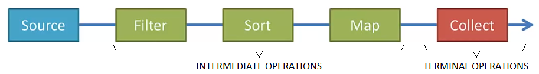

# Java Streams Examples
Code examples from: [Java 8 Streams Tutorial](https://youtu.be/t1-YZ6bF-g0)

## Introduction
Streams bring functional programming to Java, and are supported starting in Java 8. A stream pipeline consists of a 
source followed by zero or more intermediate operations; and a terminal operation. 

The main advantages of Streams are:

- Will make you a more efficient Java programmer
- Make heavy use of lambda expressions
- ParallelStreams make it very easy to multi-thread operations

## Stream Elements


 
- **Source:** Streams can be created from Collections, List, Sets, ints, longs, doubles, arrays, lines of a file
- **Stream Operations:** Are either intermediate or terminal:
    - **Intermediate Operations:** Such as filter, map or short return a stream so we can chain multiple intermediate 
        operations. Zero or more intermediate operations are allowed. Other matters for large datasets: filter first, 
        then sort a map. For very large datasets, use ParallelStream to enable multiple threads. Intermediate operations
        include:
        ```
        anyMatch()       flatMap()
        distinct()       map()
        filter()         skip()
        findFierst()     sorted()
        ``` 
    - **Terminal operations:** Such as forEach, collect or reduce are either void or return a non-stream result.
        - **forEach:** Applies the same function to each element.
        - **collect:** Saves the elements into a collection.
        - **other options:** Reduce the stream to a single summary element (`a, b, c,... => Z`)
            ```
            count()     min()
            max()       reduce()
                        summaryStatistics()
            ```
 